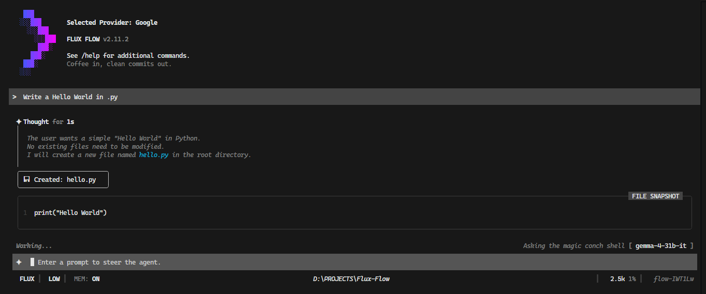

# 🌊 Flux Flow


**A Beautiful, Autonomous Terminal AI Agent**

Flux Flow is an advanced, fully autonomous AI agent that lives directly in your terminal. Built with Node.js and [Ink](https://github.com/vadimdemedes/ink) (React for interactive command-line apps), it provides a highly responsive, component-based UI powered by a sophisticated dual-model AI architecture.

Whether you need a conversational partner or an autonomous developer that can write code, run shell commands, and read your project files, Flux Flow adapts to your needs.

---

## ✨ Features

- **Responsive Terminal UI**: A gorgeous, reactive interface built with React and Ink, featuring multi-line input, status bars, modals, and diff views.
- **Dual-Model Architecture**: A primary agent interacts with you and executes tasks, while a silent background "Janitor" model handles chat summarization and long-term memory extraction without blocking the main UI.
- **Two Operating Modes**:
  - **Flux (Dev Mode)**: Full system access. The agent can read/write files, execute shell commands, and run autonomous agentic loops (up to 45 iterations) to solve complex coding tasks.
  - **Flow (Chat Mode)**: Focused on conversation and web research, with limited agentic loops for faster response times.
- **Advanced Memory System**: Features both temporary session context and persistent, cross-session user memories encrypted locally on your machine.
- **Agentic Tooling**: Built-in tools for smart file patching, web scraping, web searching, and terminal execution.
- **Autonomous Project Alignment**: Automatically detects and adheres to project-specific instructions in `Agent.md`, `Skills.md`, and `Fluxflow.md` for high-fidelity coding standards and complex workflows.
- **Customizable "Thinking" Levels**: Adjust the depth of the model's reasoning process (from Minimal to Max).

## 🚀 Quick Start

### Prerequisites
- [Node.js](https://nodejs.org/) (v18 or higher recommended)
- `npm`, `yarn`, or `pnpm`

### Via NPM (Global & Instant)
You can run the agent instantly or install it globally for high-speed access:

```bash
# Run instantly (Zero Setup)
npx fluxflow-cli

# OR Install Globally
npm install -g fluxflow-cli
fluxflow
```

### From Source (Local Development)
1. Clone the repository and install dependencies:
   ```bash
   git clone <repository-url>
   cd Flux-Flow
   npm install
   ```

2. Start the agent:
   ```bash
   npm start
   ```

## 📖 Documentation

To keep this README concise, detailed information about specific components of Flux Flow has been split into separate documents:

- **[Architecture & Design](./ARCHITECTURE.md)**: Deep dive into the React/Ink rendering, the Agentic Loop, and the Janitor background process.
- **[Agent Tools & Capabilities](./TOOLS.md)**: A comprehensive list of the tools available to the agent (e.g., File I/O, Execution, Web tools).
- **[UI & Interaction Features](./UI_FEATURES.md)**: Details on commands, thinking levels, and human-in-the-loop verification.

## 🔒 Security & Privacy

Flux Flow runs entirely locally on your machine.
- **Global Storage**: All history, memories, and API keys are stored securely in your home directory at `~/.fluxflow`. Sensitive data is encrypted.
- **Nuclear Reset**: Use the `/reset` command to instantly purge all logs, secrets, and settings from the global storage directory.
- **Configurable Boundaries**: In Flux mode, file access can be strictly confined to the Current Working Directory, or expanded globally via settings.
- **API Keys**: You supply your own Gemini/Google AI Studio API keys.

## 🛠️ Built With

- **[React](https://react.dev/) & [Ink](https://github.com/vadimdemedes/ink)**: For the interactive CLI rendering.
- **[@google/genai](https://www.npmjs.com/package/@google/genai)**: The core AI SDK powering the agent's intelligence.
- **[chalk](https://www.npmjs.com/package/chalk) & [gradient-string](https://www.npmjs.com/package/gradient-string)**: For terminal styling and aesthetics.
- **[fs-extra](https://www.npmjs.com/package/fs-extra)**: For robust file system operations.

---
*Created as a demonstration of highly capable AI tooling.*